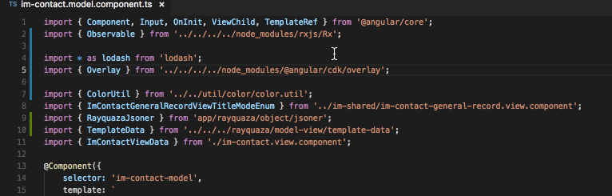

# aron-import README

Typescript import sorter.

## Features

The order of typescript file will be sort automatically on save file. Unnecessary import path like `../../node_modules/...` will be remove at the same time.

All you need to do just save file as before.



## Commands

press `F1` then enter `aronImportSort` to trigger sort manually.

press `F1` then enter `aronImportDisable` to disable automatical sort.

press `F1` then enter `aronImportEnable` to enable automatical sort again.

## Known Issues

Can't recognize mutiply line import like below. Please `aronImportDisable` temporarily. I will try to fix it soon.

```typescript
import {
    Component,
    OnInit,
} from '@angular/core';
```
