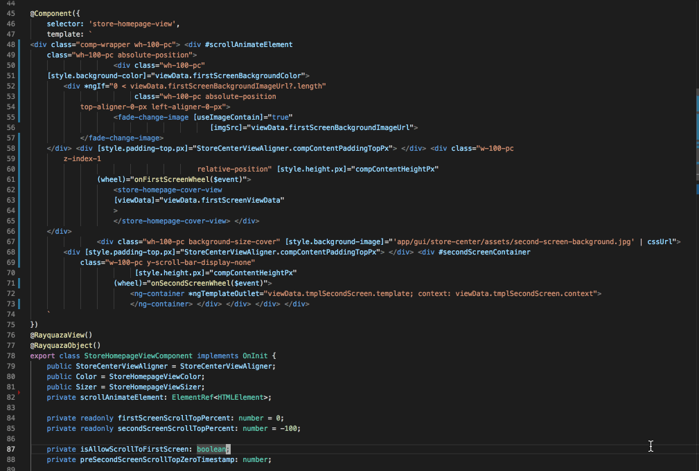

AronImport is a VSCode extension used in Netease MoltenCore team, in order to improve productivity and code quality.

* [Sort "import" statements of TypeScript code](#sort-import)
* [Format inline template of Angular component](#format-template)

## Sort Import

Sort "import" statements of TypeScript code, in the order of MoltenCore team convention.

Import statements are divided into 4 section in following order, Statements of each section are sorted alphabetically by paths.
1. Standard libraries.
2. Third party libraries.
3. Absolute paths to modules of current project.
4. Relative paths to modules of current project.

## Format Template

Format inline template of Angular component.

These are some extra convention of MoltenCore team:
1. One content per-line in attributes (e.g "style" "class"). All have the same indent.
2. Nested tag should indent. Closed tag is wrapped in the next line.
3. Indent use 4 spaces.
